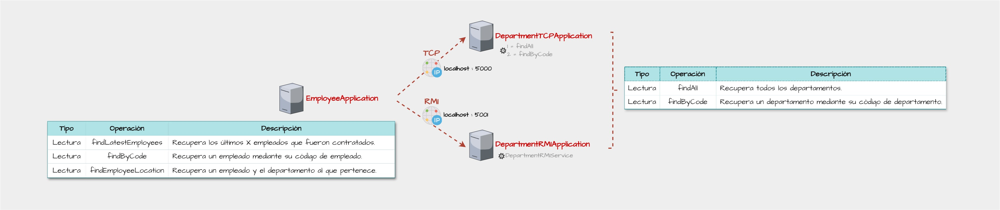
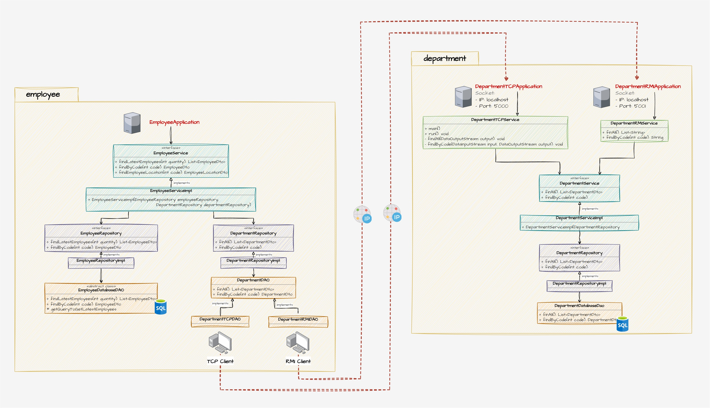

# Caso de estudio
> - Aplicación implementada en Java que pone en práctica patrones de diseño, acceso a base de datos y networking con TCP y RMI.
> - Esta aplicación identifica a los empleados pertenecientes a un departamento.

## Diagrama de base de datos

## Diagrama cliente-servidor

## Diagrama UML

## Pre requisitos
- MySQL
- Java 11 o superior

## Despliegue local
- Ejecutar el script `mysql-script.sql` en MySQL para crear la base de datos y la data de prueba.
- Compilar el proyecto `commons-v1` el cual contiene las utilidades comunes a `department-v1` y `employee-v1`.
- Ejecutar `department-v1` a través de `DepartmentRMIApplication` y/o `DepartmentTCPApplication`. Con esto la aplicación quedará a la escucha de las peticiones entrantes.
- Ejecutar `employee-v1` a través de `EmployeeApplication`.
