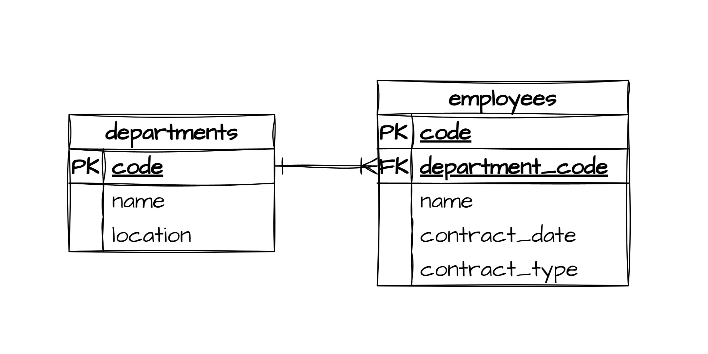
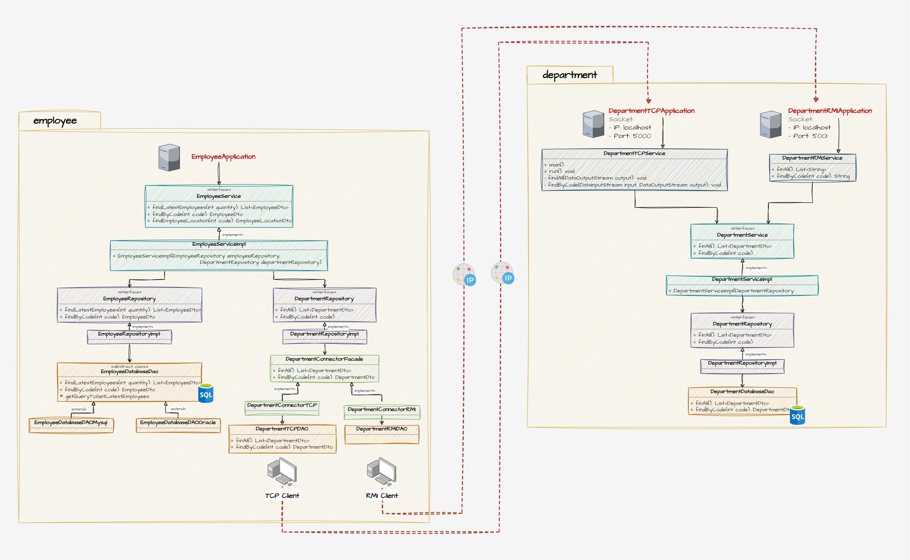

# Caso de estudio
> - Aplicación implementada en Java 7 que pone en práctica patrones de diseño, acceso a base de datos y networking con sockets.
> - Esta aplicación identifica a los empleados que pertenecientes a un departamento.

## Diagrama de base de datos

## Arquitectura cliente-servidor

## Pre requisitos
- MySQL
- Java 7 o superior

## Despliegue local
- Ejecutar el script `mysql-script.sql` en MySQL para crear la base de datos y la data de prueba
- Exponer los servicios de departamentos a través de la aplicación `DepartmentRMIApplication` y/o `DepartmentTCPApplication`
- Consumir los servicios antes expuestos a través de la aplicación `EmployeeApplication`
