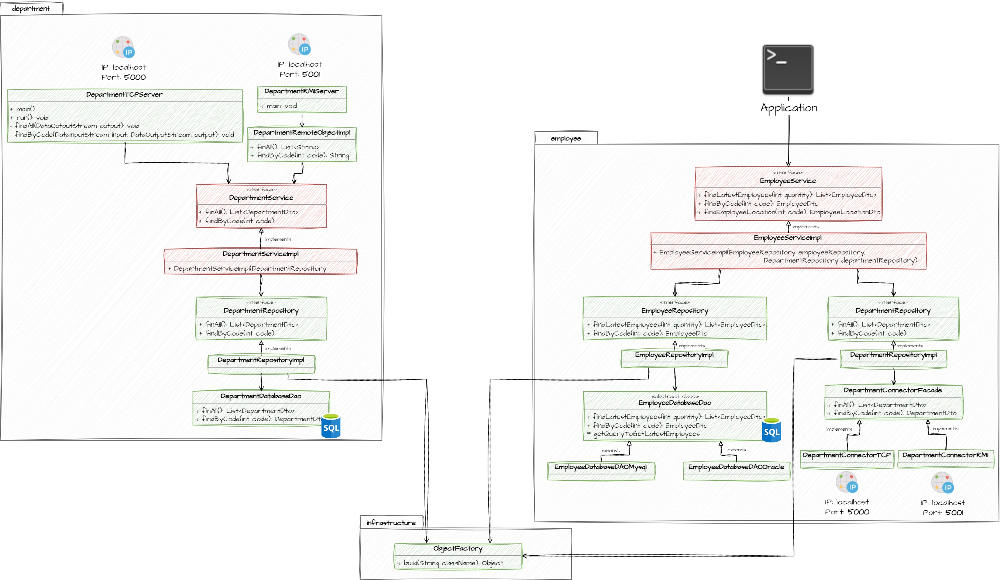

# DEMO JAVA 7
Aplicación implementada en Java 7 que pone en práctica el uso de patrones de diseño, arquitectura limpia, acceso a base 
de datos con JDBC y networking con sockets.

## Diagrama UML

## Pre requisitos
- MySQL

## Despliegue local
- Ejecutar el script `mysql-script.sql` en MySQL para crear la base de datos y la data de prueba
- Ejecutar los servidores `DepartmentTCPServer` y `DepartmentRMIServer`
- Ejecutar el método main de la clase principal `Application`
