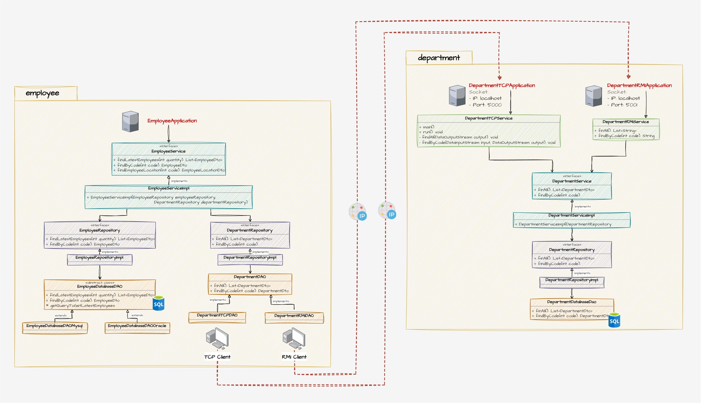

# Empleados
Aplicación implementada en Java 7 que pone en práctica el uso de patrones de diseño, acceso a base 
de datos con JDBC y networking con sockets.

# 1. Caso de estudio
Se requiere una aplicación capaz de identificar a los empleados que pertenecen a un departamento.

## Diagrama BD

## Diagrama UML

## Pre requisitos
- MySQL

## Despliegue local
- Ejecutar el script `mysql-script.sql` en MySQL para crear la base de datos y la data de prueba
- Exponer los servicios de departamentos a través de la aplicación `DepartmentRMIApplication` y/o `DepartmentTCPApplication`
- Consumir los servicios antes expuestos a través de la aplicación `EmployeeApplication`
